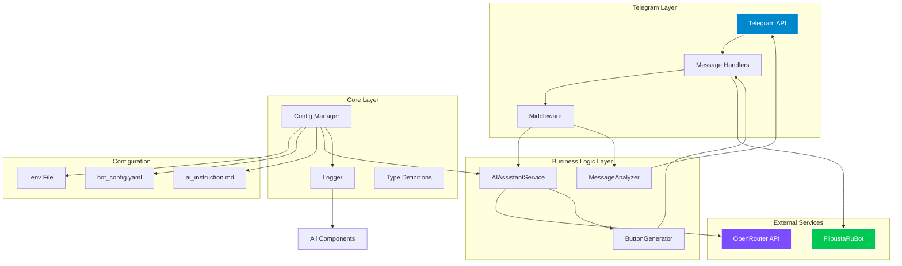

# 🏗️ FlibustaUserAssistBot - System Architecture

## 📋 Project Overview

**FlibustaUserAssistBot** is an AI-powered Telegram assistant bot that helps users interact with the FlibustaRuBot by providing intelligent suggestions and generating reply buttons with appropriate commands.

### Core Functionality
- Monitors group messages and channel comments
- Uses AI (OpenRouter/DeepSeek) to analyze context and generate helpful suggestions
- Creates reply keyboard buttons that send commands to @FlibustaRuBot
- Supports hot-reloadable configuration and AI instructions

---

## 🎯 System Goals

### Primary Objectives
1. **Intelligent Assistance**: Provide context-aware suggestions for interacting with FlibustaRuBot
2. **Seamless Integration**: Work alongside FlibustaRuBot without interfering with its operations
3. **User-Friendly**: Generate one-click buttons for common Flibusta commands
4. **Configurable**: Support runtime configuration changes without restarts
5. **Scalable**: Built with async/await patterns for high performance

### Non-Goals
- Direct book search functionality (handled by FlibustaRuBot)
- User authentication or authorization
- Complex state management across sessions

---

## 🏛️ Architecture Overview



---

## 📦 Component Architecture

### 1. Core Layer (`src/bot/core/`)

#### Config Manager (`config.py`)
**Responsibilities:**
- Load and validate configuration from multiple sources
- Provide thread-safe access to configuration
- Support hot-reloading of YAML and instruction files
- Type-safe configuration using Pydantic models

**Key Features:**
- Environment variable loading via `python-dotenv`
- YAML configuration parsing via `PyYAML`
- File watching with `watchdog` for hot-reload
- Singleton pattern for global access

**Configuration Sources:**
1. `.env` file - Sensitive data (API tokens)
2. `bot_config.yaml` - Bot behavior settings
3. `ai_instruction.md` - AI assistant instructions

#### Logger (`logger.py`)
**Responsibilities:**
- Centralized logging configuration
- Multi-output logging (stdout + file)
- Log rotation and retention
- Structured logging for better debugging

**Log Levels:**
- `DEBUG` - Detailed execution traces
- `INFO` - General information messages
- `WARNING` - Potential issues
- `ERROR` - Recoverable errors
- `CRITICAL` - Fatal errors

#### Type Definitions (`types.py`)
**Responsibilities:**
- Define type aliases and data structures
- Pydantic models for validation
- Telegram API type definitions
- OpenRouter API request/response models

**Key Types:**
- `ChatContext` - Conversation history and metadata
- `AIResponse` - Structured AI response
- `ButtonCommand` - Button action definition
- `TelegramMessage` - TypedDict for Telegram messages

---

### 2. External Clients (`src/bot/clients/`)

#### OpenRouter Client (`openrouter_client.py`)
**Responsibilities:**
- Async communication with OpenRouter.ai API
- Handle rate limiting and retries
- Error handling and timeout management
- Response parsing and validation

**API Integration:**
- Endpoint: `https://openrouter.ai/api/v1/chat/completions`
- Model: `nex-agi/deepseek-v3.1-nex-n1:free`
- Authentication: Bearer token from config
- Timeout: 30 seconds default

**Features:**
- Exponential backoff for retries
- Request deduplication
- Response caching (optional)

---

### 3. Services Layer (`src/bot/services/`)

#### AI Assistant Service (`ai_assistant.py`)
**Responsibilities:**
- Generate AI responses based on conversation context
- Format prompts using instructions from file
- Cache and reload AI instructions dynamically
- Handle AI response errors gracefully

**Prompt Engineering:**
```
[System Instruction from ai_instruction.md]
[Conversation Context]
[User Message]
```

**Caching Strategy:**
- Cache AI instruction file content
- Reload on file modification (watchdog)
- Thread-safe access to instruction cache

#### Message Analyzer (`message_analyzer.py`)
**Responsibilities:**
- Extract conversation context from Telegram
- Retrieve message history for context building
- Filter relevant messages for AI analysis
- Build context strings for AI prompts

**Context Building:**
- Last 10 messages in the chat
- User mentions and replies
- Message timestamps and authors
- FlibustaRuBot responses

#### Button Generator (`button_generator.py`)
**Responsibilities:**
- Parse AI responses for commands/requests
- Generate Telegram reply keyboard markup
- Format buttons for FlibustaRuBot compatibility
- Handle button layout and organization

**Button Format:**
- **Commands**: `/command@FlibustaRuBot`
- **Requests**: `@FlibustaRuBot request_text`
- **Layout**: 2-3 buttons per row (adaptive)

**Button Types:**
1. **Command Buttons** - Direct Flibusta commands
2. **Search Buttons** - Pre-filled search queries
3. **Navigation Buttons** - Common navigation actions

---

### 4. Telegram Layer (`src/bot/handlers/` & `src/bot/middleware/`)

#### Message Handlers
**Group Message Handler:**
- Listen for bot mentions in group chats
- Extract context and generate AI response
- Send message with reply buttons
- Handle inline queries

**Channel Comment Handler:**
- Monitor comments on channel posts
- Provide context-aware suggestions
- Generate appropriate buttons

#### Middleware
**Logging Middleware:**
- Log all incoming updates
- Track response times
- Monitor error rates

**Error Handler Middleware:**
- Global exception catching
- User-friendly error messages
- Detailed error logging
- Graceful degradation

---

## 🔧 Configuration Architecture

### Environment Variables (`.env`)
```bash
TELEGRAM_BOT_TOKEN=your_bot_token
OPENROUTER_API_KEY=your_api_key
LOG_LEVEL=INFO
CONFIG_PATH=config/bot_config.yaml
AI_INSTRUCTION_PATH=config/ai_instruction.md
```

### Bot Configuration (`bot_config.yaml`)
```yaml
bot:
  name: "FlibustaUserAssistBot"
  username: "@FlibustaAssistantBot"
  target_bot_username: "@FlibustaRuBot"
  
telegram:
  group_chat_ids: []
  admin_user_ids: []
  
openrouter:
  model: "nex-agi/deepseek-v3.1-nex-n1:free"
  temperature: 0.7
  max_tokens: 500
  timeout: 30
  
logging:
  level: "INFO"
  file_path: "logs/bot.log"
  max_size_mb: 10
  backup_count: 5
  
hot_reload:
  enabled: true
  check_interval: 5
```

### AI Instruction File (`ai_instruction.md`)
Markdown file containing system prompt for the AI assistant with:
- Role definition
- Response format guidelines
- Flibusta command examples
- Button generation rules
- Conversation flow patterns

---

## 🔄 Data Flow

### Message Processing Flow


---

## 🗄️ Data Models

### ChatContext
```python
class ChatContext(TypedDict):
    chat_id: int
    user_id: int
    message_id: int
    message_text: str
    message_history: List[TelegramMessage]
    timestamp: datetime
    chat_type: str  # "group" | "channel" | "private"
```

### AIResponse
```python
class AIResponse(BaseModel):
    text: str
    suggestions: List[str]
    commands: List[str]
    confidence: float
    model_used: str
```

### ButtonCommand
```python
class ButtonCommand(BaseModel):
    text: str
    command: str
    type: str  # "command" | "search" | "navigation"
    priority: int
```

---

## 🔐 Security Considerations

### API Key Management
- Store sensitive keys in `.env` file (excluded from git)
- Use environment-specific `.env` files
- Rotate API keys regularly
- Validate token permissions

### Telegram Security
- Verify bot token integrity
- Validate incoming webhook data
- Rate limiting per user/chat
- Admin-only configuration changes

### Data Privacy
- No persistent user data storage
- Log only necessary information
- Anonymize logs where possible
- Comply with Telegram ToS

---

## 📈 Scalability Considerations

### Horizontal Scaling
- Stateless design (no session storage)
- Multiple bot instances behind load balancer
- Redis for distributed caching (future)
- Database for analytics (future)

### Performance Optimization
- Async/await throughout
- Request batching where possible
- Response caching
- Connection pooling

### Monitoring
- Health check endpoints
- Metrics collection (Prometheus - future)
- Alerting on errors
- Performance dashboards

---

## 🚀 Deployment Architecture

### Container Strategy
- Multi-stage Docker builds
- Minimal base image (python:3.13-slim)
- Layer caching for faster builds
- Security scanning

### Environment Configuration
- Docker Compose for local development
- Kubernetes manifests for production (future)
- ConfigMap for configuration
- Secret management for API keys

### CI/CD Pipeline
- Automated testing on PR
- Docker image building
- Security scanning
- Automated deployment to staging
- Manual approval for production

---

## 📝 Development Guidelines

### Code Standards
- **Type Hints**: Full type annotations (mypy --strict)
- **Formatting**: Black + isort
- **Linting**: flake8 + pylint
- **Testing**: pytest with 80%+ coverage
- **Documentation**: Docstrings for all public APIs

### Architecture Principles
- **SOLID**: Single responsibility, open/closed, etc.
- **DRY**: Don't repeat yourself
- **KISS**: Keep it simple, stupid
- **YAGNI**: You ain't gonna need it

### Async Patterns
- Use `asyncio` for I/O operations
- Avoid blocking operations
- Proper error handling in async code
- Context managers for resource cleanup

---

## 🎯 Success Metrics

### Technical Metrics
- Response time < 2 seconds
- 99.9% uptime
- Zero critical bugs in production
- 80%+ test coverage

### User Metrics
- Button click-through rate > 50%
- User satisfaction (surveys)
- Reduction in manual Flibusta commands
- Increased engagement in groups

---

## 🔮 Future Enhancements

### v1.1.0
- Rate limiting per user
- AI response caching
- Prometheus metrics
- Health check endpoints

### v1.2.0
- Multi-language support (i18n)
- Web admin panel
- Per-group instruction customization
- Analytics dashboard

### v2.0.0
- Redis integration
- PostgreSQL for logging
- Load balancing
- Microservices architecture

---

**Architecture Version:** 1.0  
**Last Updated:** 2026-01-08  
**Maintainer:** Development Team